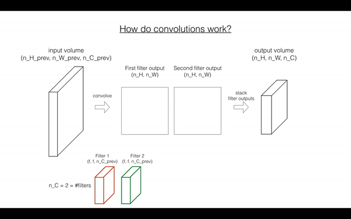

## Convolutional Neural Networks: Step by Step

###### In this notebook, I solve the question from the third course of deep- learning specialization convolutional neural network  with Andrew Ng first week first programing exercise.We use numpy to implement the functions from scratch. 

## How do convolutional work? 
#### step_by_step implementation
